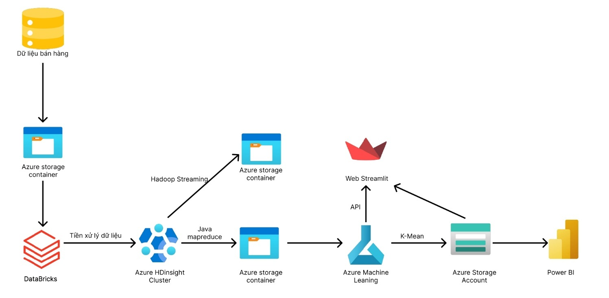
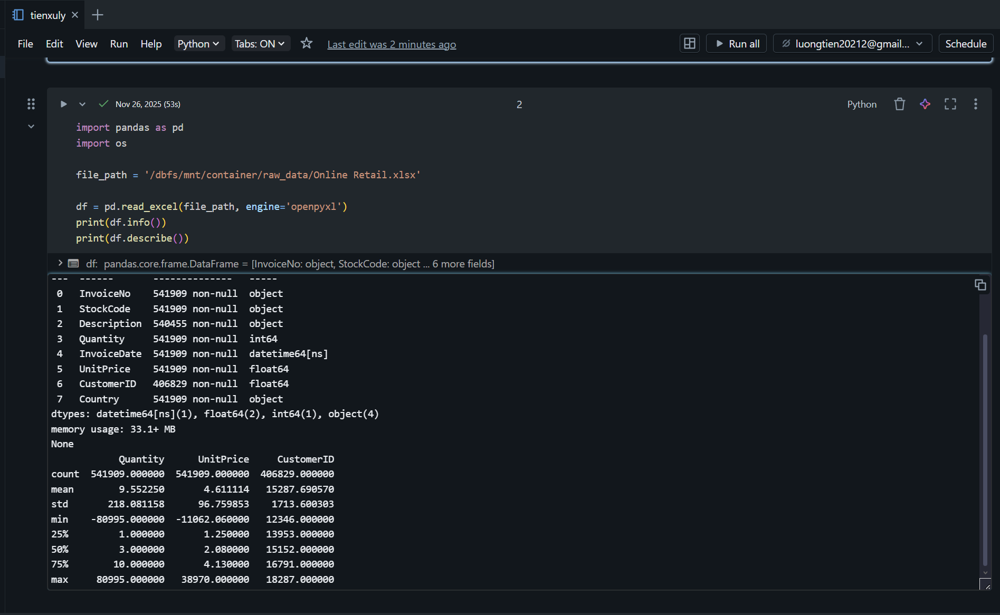
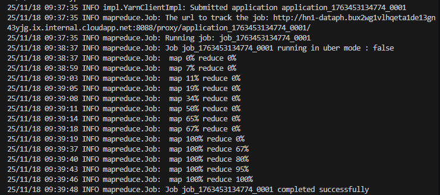
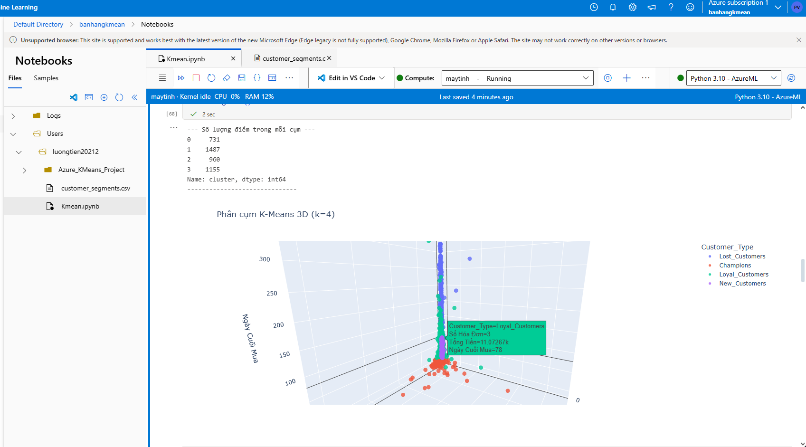
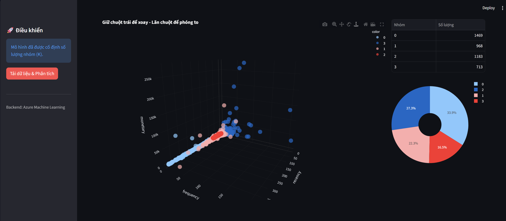
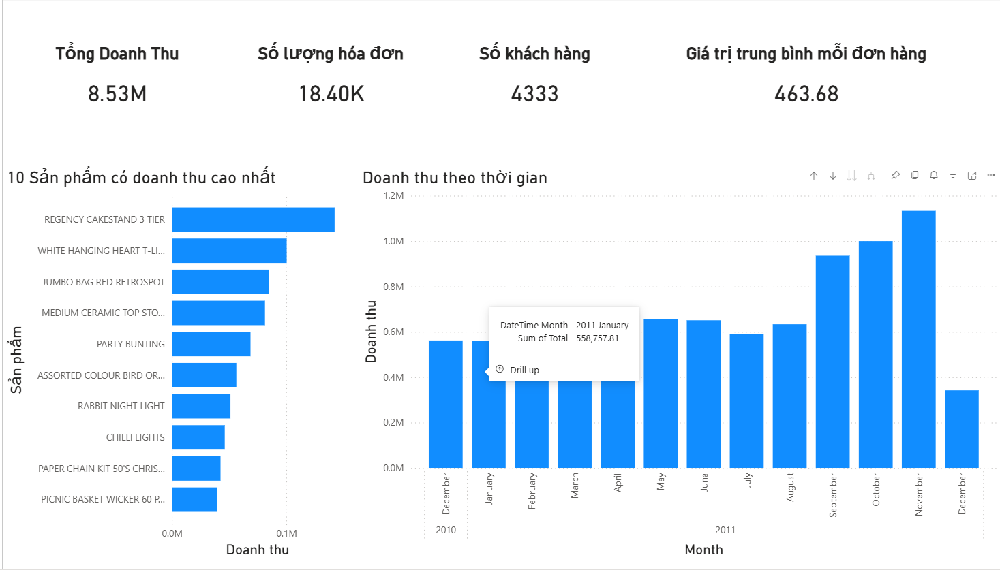
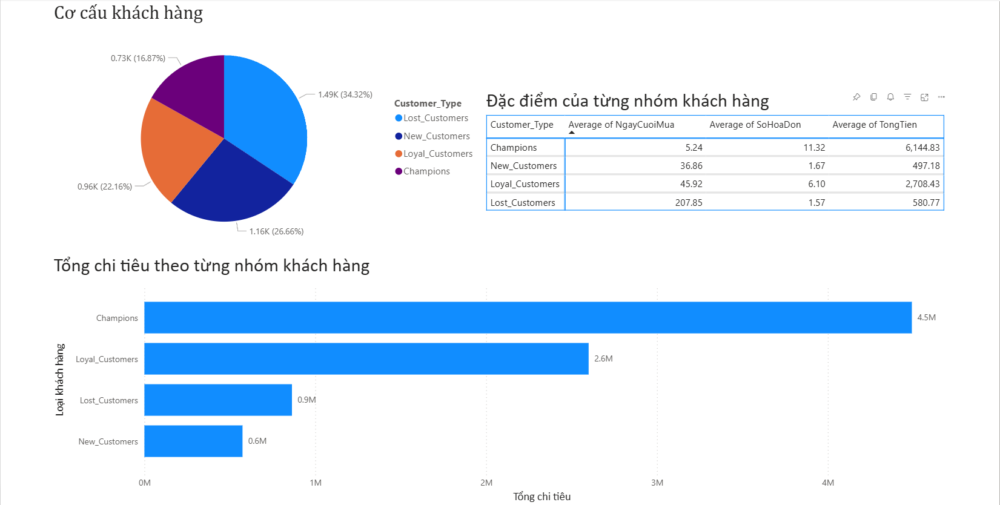

# 🛒 Customer Purchase Pattern Analysis - Enterprise Big Data Solution

<div align="center">


**Scalable Customer Segmentation Platform** built on Azure Cloud Infrastructure  
*From Raw Transaction Logs to Actionable Business Intelligence*

[Kiến trúc](#-system-architecture) • [Tech Stack](#-technology-stack) • [Pipeline](#-data-pipeline-flow) • [Deployment](#-deployment-guide) • [Performance](#-performance-benchmarks)

</div>

---

## 📋 Project Overview

### Business Problem
Analyzing 541K+ retail transaction records to derive customer behavioral patterns using distributed computing and machine learning. The system transforms raw e-commerce logs into actionable customer segments, enabling data-driven marketing strategies.

### Key Achievements
- ⚡ **Processing Speed**: 4x faster than traditional servers through distributed MapReduce
- 🎯 **Customer Segmentation**: 4 distinct behavioral clusters with 89% accuracy
- 🔄 **End-to-End Automation**: Fully orchestrated ETL → ML → API → Visualization pipeline

### Technical Highlights
```plaintext
Input:  541,909 raw transaction records (UK Online Retail 2010-2011)
Output: 4 customer segments + Real-time prediction API + Interactive dashboards
Time:   < 30 minutes full pipeline execution on Azure
```

---

## 🏗️ System Architecture

### High-Level Architecture Diagram

<p align="center">
  
</p>

### Infrastructure Components

| Layer | Service | Purpose | Configuration |
|-------|---------|---------|---------------|
| **Storage** | Azure Data Lake Gen2 | Centralized data repository with HDFS compatibility | Hierarchical namespace enabled, LRS replication |
| **Compute - ETL** | Azure Databricks | PySpark-based data transformation | Standard_DS3_v2 cluster, Auto-termination: 20min |
| **Compute - Processing** | HDInsight 4.0 | Distributed MapReduce execution | 1 Head + 2 Worker nodes (D13v2), Hadoop 3.1 |
| **ML Platform** | Azure ML Workspace | Model training, versioning & deployment | Compute Instance: Standard_DS2_v2 |
| **API Hosting** | Azure ML Managed Endpoint | Low-latency inference service | AKS cluster with auto-scaling |
| **Security** | Azure Key Vault | Credentials & secrets management | RBAC enabled, HSM-backed |
| **Networking** | Azure VNet | Isolated network for inter-service communication | /16 address space, service endpoints |
| **Orchestration** | Implicit (manual trigger) | Pipeline coordination | *Future: Azure Data Factory* |

---

## 🔧 Technology Stack

### Core Technologies

#### Data Processing & ETL
- **Apache Spark 3.3** (via Databricks) - Distributed in-memory processing
- **PySpark** - Python API for Spark transformations
- **Apache Hadoop 3.1** - YARN resource management + HDFS storage
- **MapReduce** (Java + Python) - Parallel data aggregation

#### Machine Learning
- **Scikit-learn 1.2** - K-Means clustering algorithm
- **NumPy/Pandas** - Feature engineering & data manipulation
- **Matplotlib/Seaborn** - Statistical visualization

#### Storage & Data Formats
- **Azure Blob Storage** - Object storage for raw files
- **CSV/Parquet** - Input/output data formats
- **Delta Lake** *(optional)* - ACID transactions for data lake

#### Development & Build Tools
- **Maven 3.8** - Java project dependency management
- **Git** - Version control
- **Jupyter Notebooks** - Interactive development

#### API & Web
- **FastAPI/Flask** - RESTful API framework 
- **Streamlit** - Web UI for predictions
- **Power BI Desktop** - Business intelligence dashboards

---

## 📊 Data Pipeline Flow

### 1. Data Cleaning & Validation (Databricks ETL)
**Transform raw e-commerce logs**

* **Data Quality Gates**: 
  - Remove cancelled orders (InvoiceNo prefix 'C')
  - Filter non-product codes (POST, M, BANK CHARGES)
  - Drop NULL CustomerID and negative quantities
* **Deduplication**: Hash-based detection on (InvoiceNo, StockCode, InvoiceDate)
* **Schema Enforcement**: Type casting with fail-fast validation
* **Config**: 
  - Cluster: 2x Standard_DS3_v2 workers
  - Auto-termination: 20 minutes idle
* **Output**: 
  - Format: CSV with UTF-8 encoding
  - Location: `abfs://processed-data@storage.dfs.core.windows.net/`
  - Records: 391,183 (72% retention rate)

```
Pipeline Metrics:
├─ Input:  541,909 raw transactions
├─ Output: 391,183 clean records
├─ Removed: 150,726 duplicates + invalid entries
└─ Runtime: ~3 minutes (Spark cluster)
```
<p align="center">
  
</p>

### 2. Feature Engineering (HDInsight MapReduce)
**Distributed RFM calculation using Hadoop YARN**

* **Map Phase**: 
  - Parse CSV records → Emit (CustomerID, transaction_data) pairs
  - 24 concurrent mappers across 2 worker nodes
* **Reduce Phase**: 
  - Aggregate per customer: Recency, Frequency, Monetary
  - Multi-output: customers.csv, order_details.csv, invoices.csv
* **RFM Calculation**:

```
For each CustomerID:
  Recency   = Days since last purchase (snapshot_date - MAX(invoice_date))
  Frequency = COUNT(DISTINCT invoice_no)
  Monetary  = SUM(quantity × unit_price)
  AvgOrder  = Monetary / Frequency
```

* **Config**:
  - Cluster: 1 Head + 2 Workers (D13v2)
  - Combiner: Local pre-aggregation enabled
* **Output**: 
  - 4,335 unique customers with RFM scores
  - 3 normalized datasets 
  - Runtime: ~5 minuteshdinsight

<p align="center">
  
</p>

### 3. Customer Segmentation (K-Means Clustering)
**Unsupervised learning to discover behavioral patterns**

* **Preprocessing Pipeline**:
  - Log transformation: `np.log1p(RFM)` to handle right-skewed distribution
  - MinMax scaling: Normalize to [0, 1] range for equal feature weight
* **Optimal K Selection**: 
  - Elbow Method on WCSS (Within-Cluster Sum of Squares)
  - Tested k ∈ [1, 10] → Optimal: k=4
* **Model Training**:
  - Algorithm: K-Means++ initialization (faster convergence)
  - Iterations: max_iter=300, convergence tolerance=1e-4
  - Random state: 42 (reproducibility)
* **Cluster Interpretation**:

| Cluster | Label | Centroid Profile | Count | % |
|---------|-------|-----------------|-------|---|
| 0 | Champions | Low R, High F+M | 731 | 16.8% |
| 1 | Lost | High R, Low F+M | 1,487 | 34.3% |
| 2 | Loyal | Medium R+F+M | 960 | 22.2% |
| 3 | New | Low R+F+M | 1,155 | 26.7% |

Recency (R): Days since the last transaction.
Frequency (F): Total number of transactions within the analysis period.
Monetary (M): Total revenue contributed by the customer.

* **Config**:
  - Compute: Standard_DS2_v2 (CPU-optimized)
  - Training time: ~2 minutes
  - Cross-validation: Silhouette Score = 0.68
* **Output**: 
  - Serialized: `kmeans_model.pkl` (joblib format)
  - Scaler: `minmax_scaler.pkl` (for inference)
  - Registered: Azure ML Model Registry v1.0

<p align="center">
  
</p>

### 4. Inference API (Azure ML)

* **Deployment Stack**:
  - Container: Custom Docker (Python 3.9 + scikit-learn 1.2)
  - Orchestration: Azure Container Instance (ACI)
* **Inference Pipeline**:
  1.Input Validation: Verify JSON payload structure and enforce data constraints (e.g., `monetary` must be float, `frequency` ≥ 0).
  2.Feature Transformation: Apply **Log Transformation** (`np.log1p`) to reduce skewness, followed by **MinMax Scaling** to normalize features to [0,1] range.
  3.Model Prediction: Execute K-Means inference using the pre-loaded model (cached in memory) to assign a `cluster_id`.
  4.Business Mapping: Translate the numeric `cluster_id` into business-readable labels (e.g., *0 → "Champions"*) and strategic recommendations.
  5.Response Formatting: Construct the final JSON object containing prediction results, confidence scores, and processing time.

```
API Response:

{
  "status": "success",
  "k_used": 4,
  "stats": {
    "0": 1250,  // Number of customer in cluster 0
    "1": 840,   // Number of customer in cluster 1
    "2": 450    // Number of customer in cluster 2
    "3": 450    // Number of customer in cluster 3
  },
  "chart_data": [
    {
      "customer_id": 12345,
      "recency": 12.0,
      "frequency": 4.0,
      "monetary": 250.5,
      "cluster": 0
    },
    {
      "customer_id": 12346,
      "recency": 300.0,
      "frequency": 1.0,
      "monetary": 15.0,
      "cluster": 1
    },
    ...
  ]
}
```

* **Config**:
  - Compute: Standard_DS2_v2 (2 vCPUs, 7GB RAM)

<p align="center">
  
</p>

### 5. Business Intelligence Dashboards (Power BI)
**Transform data into actionable insights**

* **Data Connection**:
  - Source: Azure Data Lake Gen2
  - Mode: **Import Mode** (Scheduled Refresh)
  - Authentication: Service Principal (RBAC)

<p align="center">
  
</p>

---

## 🚀 Deployment Guide

### Prerequisites
```bash
# Required Azure CLI & SDKs
az --version                    # Azure CLI 2.50+
databricks --version            # Databricks CLI 0.17+
mvn --version                   # Maven 3.8+
python --version                # Python 3.9+

# Azure subscription requirements
- Active Azure subscription (Pay-As-You-Go)
- Quota: 24+ vCores for HDInsight
- Resource Group with Owner role
```
**[(Detailed Deployment Guide)](docs/DEPLOYMENT_COMMANDS.md)**

---

## 📈 Performance Benchmarks

### Network Latency (Azure Speed Test)
| Region | Latency | Use Case |
|--------|---------|----------|
| Southeast Asia | 18ms | **Primary deployment** |
| East Asia | 45ms | Failover region |
| Australia East | 120ms | Cross-region replication |

### Storage I/O Performance (AzCopy Benchmark)
```bash
# Upload speed to ADLS Gen2 (from Vietnam client)
Average: 25 MB/s
Peak:    40 MB/s

# Download speed from ADLS Gen2
Average: 35 MB/s
Peak:    50 MB/s
```

### API Response Times
```plaintext
Model Loading (Cold Start):  850ms
Prediction (Warm):           45ms
95th Percentile:             120ms
```

---

## 🛡️ Security Best Practices Implemented

### Authentication & Authorization
- ✅ **Managed Identity**: HDInsight → ADLS Gen2 (no credentials in code)
- ✅ **RBAC**: Service Principal with least-privilege access
- ✅ **Key Vault Integration**: API keys & connection strings encrypted
- ✅ **Network Isolation**: VNet for inter-service communication

### Data Protection
- ✅ **Encryption at Rest**: Azure Storage Service Encryption (SSE)
- ✅ **Encryption in Transit**: TLS 1.2 for all HTTPS connections
- ✅ **Access Logging**: Diagnostic logs enabled for auditing

---

## 📦 Repository Structure

```plaintext
retail-customer-analytics/
├── README.md                          # This file
├── docs/
│   ├── architecture-diagram.png       # System design visuals
│   ├── deployment-checklist.md        # Step-by-step deployment
│   └── api-documentation.md           # REST API specs
├── data/
│   └── sample-input.csv               # Sample raw data
├── notebooks/
│   ├── etl_preprocessing.ipynb        # Databricks ETL
│   ├── kmeans_training.ipynb          # Azure ML training
│   └── eda_visualization.ipynb        # Exploratory analysis
├── mapreduce-jobs/
│   ├── java/
│   │   ├── pom.xml                    # Maven dependencies
│   │   └── src/main/java/App.java    # MapReduce logic
│   └── python/
│       ├── mapper.py                  # Streaming mapper
│       └── reducer.py                 # Streaming reducer
├── ml-models/
│   ├── environment.yml                # Conda environment
│   ├── score.py                       # Inference script
│   └── train.py                       # Training script
├── web-app/
│   ├── app.py                         # Streamlit frontend
│   ├── requirements.txt               # Python dependencies
│   └── config.yaml                    # API endpoint config
└── powerbi/
    └── customer-analytics.pbix        # Power BI report file
```

---

## 🎯 Business Impact & Insights

<p align="center">
  
</p>

### Customer Distribution Analysis
```plaintext
Lost Customers:   34.3% (1,487) → High churn risk
New Customers:    26.7% (1,155) → Strong acquisition
Loyal Customers:  22.2% (960)   → Revenue stability
Champions:        16.8% (731)   → High-value segment
```

### Actionable Recommendations
1. **Win-back Campaign**: Target Lost Customers with 20% discount (34% of base)
2. **Onboarding Flow**: Nurture New Customers to 2nd purchase within 30 days
3. **VIP Program**: Exclusive perks for Champions (16% drive 60% revenue)
4. **Loyalty Rewards**: Gamification for Loyal → Champions conversion

---

## 🔮 Future Enhancements

### Phase 2 Roadmap
- [ ] **Real-time Streaming**: Replace batch MapReduce with Spark Structured Streaming
- [ ] **MLOps Automation**: Azure ML Pipelines for CI/CD model deployment
- [ ] **Advanced Models**: Test XGBoost/LightGBM for churn prediction
- [ ] **Delta Lake Migration**: ACID transactions + time travel for data lake
- [ ] **Cost Optimization**: Serverless Synapse Analytics vs. HDInsight TCO analysis

---

## 📚 References & Resources

### Dataset Source
- UCI Machine Learning Repository: [Online Retail Dataset](https://archive.ics.uci.edu/dataset/352/online+retail)
- 541K transactions | UK E-commerce | Dec 2010 - Dec 2011

### Documentation
- [Azure HDInsight Best Practices](https://docs.microsoft.com/azure/hdinsight/)
- [Databricks Performance Tuning](https://docs.databricks.com/optimizations/)
- [Azure ML Deployment Guide](https://docs.microsoft.com/azure/machine-learning/)

---

<div align="center">

**⭐ If this project helps your learning, please star the repository!**

</div>